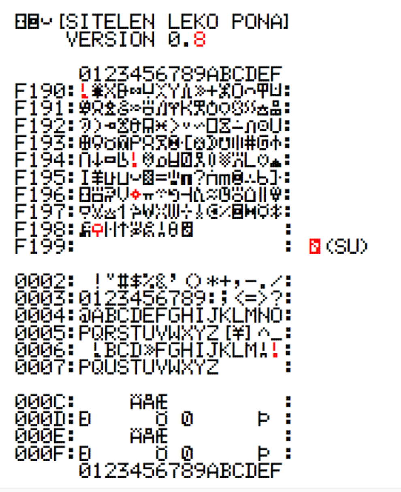
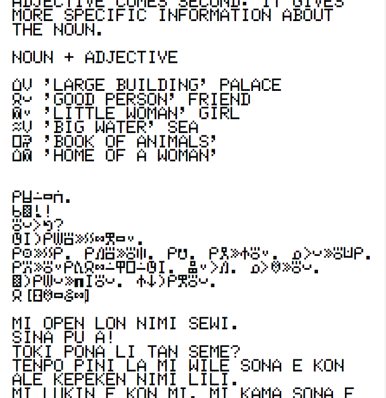

# YU-SITELEN-LEKO-PONA (Open Source Font)

v0.70  

This font is a *sitelen pona* font for *toki pona* language.  
Retro 7x5 pixels display design font. 

## Files
* SITELEN-LEKO-PONA.ttf (OpenType font)
* SITELEN-LEKO-PONA.ufo (UFO3 font format: source code)

## Glyphs

Small letters are designed as same as capital letters. (expept *a*, *e* and *o*.)

## Usage

Input word with letters sequence. e.g. {s}{i}{t}{e}{l}{e}{n}, then they are replaced to sitelen pona letter e.g. {sitelen} letter.

You can display one space letter with inputing {space}{space}.  
* {space} => cursor no move  
* {space}{space} => one space (cursor space width move)  

For example, if you can display *mi sitelen kepeken sitelen pona.*, you input this:  
{m}{i}{space}{s}{i}{t}{e}{l}{e}{n}{space}{k}{e}{p}{e}{k}{e}{n}{space}{s}{i}{t}{e}{l}{e}{n}{space}{p}{o}{n}{a}{.}  
displayed like:  
{mi}{sitelen}{kepeken}{sitelen}{pona}{.}

## Sample

